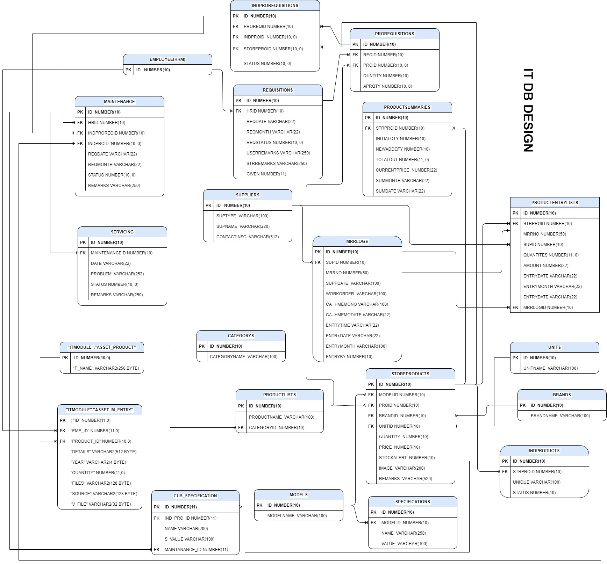

# MCS ERP Backend

## Technology used

This repository uses a number libraries to work:

- [NodeJs]
- [ExpressJs]
- [Cors]
- [OracleDB]
- [BcryptJs]
- [CookieParser]
- [DateFns]
- [BcryptJs]
- [Joi]
- [jsonwebtoken]
- [shortid]


## Screenshots
- [IT_STORE_Relation_Screenshot]


- [IT_DB_Relation_Screenshot]



## DRAW.IO Files
[STORE_DRAW.IO](./files/storeDB.drawio)
[IT_DRAW.IO](./files/IT_DB.drawio)

###  Using Status Number For IT Status
---

**Product Status**
| Status  | Meaning |
| ------------- | ------------- |
| 0 | Active  |
| 1 | Requisition  |
| 2 | Maintenance  |
| 3 | Inactive |
| 4 | Dead |


**Requisition Status**
| Status  | Meaning |
| ------------- | ------------- |
| 0 | Pending  |
| 1 | Approved  |
| 2 | Accept  |
| 3 | Deny |


**Individual Pro Requisition Status**
| Status  | Meaning |
| ------------- | ------------- |
| 0 | Approved  |
| 1 | Maintenance  |
| 2 | Dead  |


**Maintenance Status**
| Status  | Meaning |
| ------------- | ------------- |
| 0 | Pending  |
| 1 | Approved  |
| 2 | Accept  |
| 3 | Servicing |
| 4 | Back To IT |
| 2 | Dead  |
| 2 | Notify to User  |
| 2 | User Accept  |

**Asset**
| Status  | Meaning |
| ------------- | ------------- |
| 0 | Active  |
| 1 | Inactive  | 


## Run Locally

Clone the project

```bash
  git clone https://github.com/saifakib/mcs_erp_backend
```

Go to the project directory

```bash
  cd mcs_erp_backend
```

Install dependencies

```bash
  npm install
```

Start the server

```bash
  npm run dev
```

## Environment Variables

To run this project, you will need to add the following environment variables to your .env file

`PORT`
`NODE_ORACLE_STORE_DB_USER`
`NODE_ORACLEDB_STORE_PASSWORD`
`NODE_ORACLE_HR_DB_USER`
`NODE_ORACLEDB_HR_PASSWORD`
`NODE_ORACLE_IT_DB_USER`
`NODE_ORACLEDB_IT_PASSWORD`
`NODE_ORACLEDB_CONNECTIONSTRING`
`INSTANTCLIENT`

`JWT_SECRET`
`COOKIE_SECRET`


- [@SaifUddin](https://www.github.com/saifakib)

